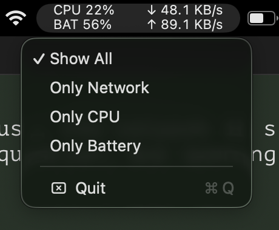

# Pulse

<p align="center">
  
</p>

## The slowdown you keep accepting

A Mac can waste your time without crashing.

A window opens late. A tab stops responding for a second. The fan starts for no clear reason. You wait, continue working, and forget about it. Then it happens again.

Each delay is small. The doubt is not. You start wondering whether the Mac is busy, the network is slow, or something is using more power than it should. Activity Monitor can answer that question, but opening it is often more effort than the problem seems to deserve.

Pulse keeps CPU, battery, and network activity visible in the menu bar. When the Mac feels wrong, you can check whether it is busy before opening Activity Monitor.

Pulse does not pretend to diagnose the cause. It gives you the facts you need to decide what to check next.

Pulse is small, local, and quiet. It does not ask you to create an account, learn a dashboard, wait for an alert, or hand your system data to a service.

If your Mac interrupts you often enough to notice, Pulse belongs in the menu bar.



## Install

Pulse runs on Apple Silicon Macs with macOS 13 or later. You do not need Xcode or the Xcode Command Line Tools to install the released app.

Install the latest release with Homebrew:

```bash
brew tap omkark96/pulse
brew install --cask omkark96/pulse/pulse
```

Homebrew trusts an explicitly requested cask on current versions. If Homebrew reports that the cask is not trusted, trust only this cask:

```bash
brew trust --cask omkark96/pulse/pulse
```

Pulse is ad-hoc signed and not notarized. If macOS blocks the first launch, open the app from Finder once, or remove its quarantine flag:

```bash
xattr -dr com.apple.quarantine /Applications/Pulse.app
open -a Pulse
```

## Choose a display mode

Click the Pulse status item, then choose a display mode:

- Show All
- Only Network
- Only CPU
- Only Battery

## Privacy

Pulse reads system data on your Mac. It does not send that data anywhere.

## License

Pulse is available under the MIT License. See [LICENSE](LICENSE).
